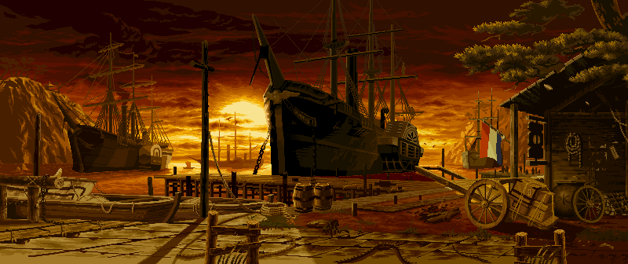
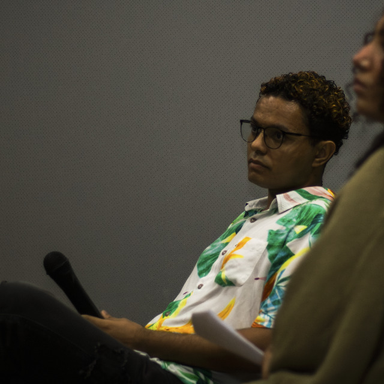

<a id="topo"></a>
<p align="center">
  
</p>

# 🏆 Batalha Naval (Godot + Rust)

<div align="center">


Projeto acadêmico desenvolvido para a disciplina de **Paradigmas de Linguagens de Programação**.


</div>

---

<a id="integrantes"></a>
## 👥 Integrantes do Projeto

<table>
  <tr>
    <td align="center">
      <a href="https://github.com/alinesors" title="Perfil da Aline">
        <br>
        <sub><b>Aline Fernanda Soares Silva</b></sub><br>
        <sub>@alinesors</sub>
      </a>
    </td>
    <td align="center">
      <a href="https://github.com/Arthur-789" title="Perfil do Arthur">
        <br>
        <sub><b>Arthur Roberto Araújo Tavares</b></sub><br>
        <sub>@Arthur-789</sub>
      </a>
    </td>
    <td align="center">
      <a href="https://github.com/ClaudersonXavier" title="Perfil do Clauderson">
        <br>
        <sub><b>Clauderson Branco Xavier</b></sub><br>
        <sub>@ClaudersonXavier</sub>
      </a>
    </td>
    <td align="center">
      <a href="https://github.com/Victor-Saraiva-P" title="Perfil do Victor">
        <br>
        <sub><b>Victor Alexandre Saraiva Pimentel</b></sub><br>
        <sub>@Victor-Saraiva-P</sub>
      </a>
    </td>
    <td align="center">
      <a href="#" title="Perfil do Marcos">
        <br>
        <sub><b>Marcos Vinicius Sousa</b></sub><br>
        <sub>@vinibcc</sub>
      </a>
    </td>
    <td align="center">
      <a href="#" title="Perfil do Ryan">
        <br>
        <sub><b>Ryan Oliveira Marques</b></sub><br>
        <sub>@a-definir</sub>
      </a>
    </td>
  </tr>
</table>

> TODO: atualizar links de GitHub pendentes dos integrantes com `href="#"`.

## 📚 Navegação da Documentação

- [📑 Índice](#indice)
- [👥 Integrantes do Projeto](#integrantes)
- [✅ Checklist de Pendências](#checklist)
- [🚀 Como Rodar o Projeto](#como-rodar)
- [❓ FAQ / Troubleshooting](#faq)
- [🛠️ Tecnologias Utilizadas](#tecnologias)
- [📞 Contato](#contato)

<a id="indice"></a>
## 📑 Índice

- [Preview](#preview)
- [Checklist de Pendências](#checklist)
- [Regras de Negócio Automatizadas](#regras-de-negócio-automatizadas)
- [Estrutura do Projeto](#estrutura-do-projeto)
- [Fluxo da Jogada](#fluxo-da-jogada)

<a id="checklist"></a>
## ✅ Checklist de Pendências

- [x] Estrutura base do README organizada
- [x] Seção de integrantes com fotos
- [x] Badge de Rust e Godot
- [x] Link "Voltar ao topo"
- [ ] Atualizar links de GitHub que ainda estao com `href="#"`
- [ ] Definir usuario final do Ryan (trocar `@a-definir`)
- [ ] Adicionar preview final (imagem/GIF oficial da versao pronta)
- [ ] Revisar e validar a seção de FAQ com base na versao final do projeto

## Preview

Preview atual do projeto:

> TODO: adicionar imagem ou GIF final da gameplay quando a versao estiver pronta.

Exemplo de uso quando estiver pronto:

```md

```

## Regras de Negócio Automatizadas

As principais regras da partida estao encapsuladas na camada de dominio:

- Validacao de jogada (tiro em celula valida).
- Resultado de disparo (`acerto`, `agua`, repeticao de jogada).
- Atualizacao do estado do tabuleiro apos cada acao.
- Mensagens de retorno para feedback da jogada.

Arquivos principais:

- `src/domain/disparo.rs`
- `src/domain/tabuleiro.rs`
- `src/domain/jogador.rs`
- `src/domain/jogador_ia.rs`

<a id="como-rodar"></a>
## 🚀 Como Rodar o Projeto

### Requisitos

- Godot 4.x
- Rust (toolchain estavel)
- Cargo

### Passo a passo

1. Clone o repositorio:

```bash
git clone https://github.com/Victor-Saraiva-P/Batalha_Naval_PLP.git
cd Batalha_Naval_PLP
```

2. Compile a extensao Rust:

```bash
cargo build
```

3. Abra o projeto no Godot:

- Abra o arquivo `project.godot`.
- Execute a cena principal do projeto (menu inicial).

<a id="faq"></a>
## ❓ FAQ / Troubleshooting

**1. O Godot nao reconhece a extensao Rust. O que fazer?**

- Rode `cargo build` novamente.
- Verifique se o arquivo `batalha_naval.gdextension` esta na raiz do projeto.
- Feche e reabra o Godot para recarregar a extensao.

**2. A imagem do README nao aparece no GitHub.**

- Confirme se o arquivo existe em `assets/images/`.
- Verifique se o nome do arquivo esta igual ao caminho no README.

**3. Alterei codigo Rust e nada mudou no jogo.**

- Recompile com `cargo build`.
- Reinicie a cena no Godot.

<a id="tecnologias"></a>
## 🛠️ Tecnologias Utilizadas

- Godot Engine
- Rust
- GDExtension

## Estrutura do Projeto

```text
src/
|-- lib.rs
|-- application/
|   |-- controlador_batalha.rs
|   `-- mod.rs
|-- domain/
|   |-- disparo.rs
|   |-- jogador.rs
|   |-- jogador_ia.rs
|   |-- tabuleiro.rs
|   `-- mod.rs
`-- presentation/
    |-- batalha/
    |   `-- renderizacao_tabuleiro/
    |-- legacy/
    `-- mod.rs
```

### O que cada camada faz

- `src/lib.rs`: ponto de entrada da biblioteca Rust e registro da extensao com `#[gdextension]`.
- `src/application/`: coordenacao de fluxo de jogo e entrada do usuario.
- `src/domain/`: regras de negocio e estado do jogo, sem dependencia da UI.
- `src/presentation/`: logica de cena e renderizacao no Godot.

## Fluxo da Jogada

1. O usuario clica no tabuleiro inimigo.
2. `ControladorBatalha` converte o clique em coordenada de celula.
3. O dominio (`executar_disparo`) retorna resultado + mensagem.
4. O controller imprime a mensagem e atualiza o tile correspondente.

## Como adicionar imagens no README

1. Crie a pasta de imagens do projeto:

```powershell
New-Item -ItemType Directory -Force assets\images
```

2. Coloque sua imagem na pasta, por exemplo:

- `assets/images/preview-menu.png`
- `assets/images/preview-batalha.png`

3. Referencie no `README.md` assim:

```md

```

4. Para GIF (demonstracao), use o mesmo formato:

```md

```

<a id="contato"></a>

## 📞 Contato

Para dúvidas, sugestões ou contribuições, entre em contato com qualquer um dos integrantes através dos perfis do GitHub listados na seção [Integrantes do Projeto](#integrantes).


[⬆ Voltar ao topo](#topo)
