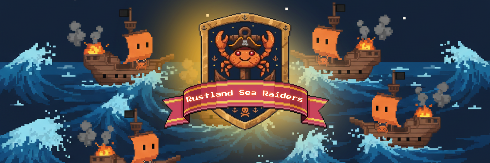

<a id="topo"></a>

<p align="center">
  
</p>

<h1 align="center">Rustland Sea Raiders (Rust + Godot)</h1>

<div align="center">


Projeto acadêmico desenvolvido para a disciplina de **Paradigmas de Linguagens de Programação**.

</div>

<p align="center">
  Jogo inspirado em Batalha Naval com interface em Godot e regras de domínio em Rust via GDExtension.
</p>

---

## Índice

- [Visão Geral](#visao-geral)
- [Destaques](#destaques)
- [Preview](#preview)
- [Tecnologias](#tecnologias)
- [Arquitetura e Regras de Negócio](#arquitetura-e-regras-de-negocio)
- [Estrutura do Projeto](#estrutura-do-projeto)
- [Como Executar](#como-executar)
- [FAQ](#faq)
- [Integrantes](#integrantes)
- [Contato](#contato)

<a id="visao-geral"></a>
## Visão Geral

`Rustland Sea Raiders` é um jogo inspirado em Batalha Naval, com interface em Godot e regras principais implementadas em Rust via GDExtension.

<a id="destaques"></a>
## Destaques

- Regras de jogo isoladas na camada de domínio (`src/domain/`)
- Integração Rust + Godot com GDExtension
- Organização modular por responsabilidades
- Fluxo de partida separado por fases e gerenciadores

## Preview


<a id="tecnologias"></a>
## Tecnologias

- Godot Engine 4.x
- Rust (toolchain estável)
- Cargo
- GDExtension

<a id="arquitetura-e-regras-de-negocio"></a>
## Arquitetura e Regras de Negócio

As regras da partida estão concentradas na camada de domínio, incluindo:

- Validação de jogadas
- Resolução de disparos (`acerto`, `água` e repetição)
- Atualização de estado do tabuleiro
- Retorno de mensagens para feedback ao jogador

Arquivos centrais da lógica:

- `src/domain/disparo.rs`
- `src/domain/tabuleiro.rs`
- `src/domain/jogador.rs`
- `src/domain/jogador_ia.rs`

<a id="estrutura-do-projeto"></a>
## Estrutura do Projeto

```text
src/
|-- lib.rs
|-- application/
|   |-- controlador_batalha.rs
|   |-- fase_posicionamento.rs
|   |-- fase_selecao_dificuldade.rs
|   |-- gerenciador_audio.rs
|   |-- gerenciador_efeito.rs
|   |-- gerenciador_interface.rs
|   |-- gerenciador_turnos.rs
|   |-- helpers/
|   |-- nodes/
|   |-- services/
|   `-- mod.rs
|-- domain/
|   |-- disparo.rs
|   |-- jogador.rs
|   |-- jogador_ia.rs
|   |-- tabuleiro.rs
|   |-- entidades/
|   |-- estrategias_ia/
|   |-- repositorios/
|   `-- mod.rs
|-- infrastructure/
|   |-- repositorio_usuario_json.rs
|   `-- mod.rs
`-- presentation/
    |-- batalha/
    |-- cena_fim_de_jogo.rs
    |-- cena_ranking.rs
    `-- mod.rs
```

Responsabilidades por camada:

- `src/lib.rs`: ponto de entrada da extensão Rust e registro com `#[gdextension]`
- `src/application/`: coordenação do fluxo de jogo e orquestração entre domínio e interface
- `src/domain/`: regras de negócio e estado da partida, sem dependência de UI
- `src/infrastructure/`: persistência e integrações externas
- `src/presentation/`: lógica de apresentação e integração com cenas Godot

<a id="como-executar"></a>
## Como Executar

Pré-requisitos:

- Godot 4.x
- Rust instalado (`rustup`)
- Cargo

1. Clonar o repositório:

```bash
git clone https://github.com/Victor-Saraiva-P/Batalha_Naval_PLP.git
cd Batalha_Naval_PLP
```

2. Compilar a extensão Rust:

```bash
cargo build
```

3. Abrir no Godot:

- Abrir o projeto pelo arquivo `project.godot`
- Executar a cena inicial (menu principal)

Comandos úteis durante o desenvolvimento:

```bash
cargo build
cargo check
cargo test
```

<a id="faq"></a>
## FAQ

**O Godot não reconhece a extensão Rust.**

- Execute `cargo build` novamente
- Verifique se `batalha_naval.gdextension` está na raiz do projeto
- Feche e abra o Godot para recarregar a extensão

**Alterei código Rust e não refletiu no jogo.**

- Recompile com `cargo build`
- Reinicie a cena em execução no Godot

---

<a id="integrantes"></a>
## Integrantes

<table>
  <tr>
    <td align="center">
      <a href="https://github.com/alinesors" title="Perfil da Aline">
        <br>
        <sub><b>Aline Fernanda Soares Silva</b></sub><br>
        <sub>@alinesors</sub>
      </a>
    </td>
    <td align="center">
      <a href="https://github.com/Arthur-789" title="Perfil do Arthur">
        <br>
        <sub><b>Arthur Roberto Araújo Tavares</b></sub><br>
        <sub>@Arthur-789</sub>
      </a>
    </td>
    <td align="center">
      <a href="https://github.com/ClaudersonXavier" title="Perfil do Clauderson">
        <br>
        <sub><b>Clauderson Branco Xavier</b></sub><br>
        <sub>@ClaudersonXavier</sub>
      </a>
    </td>
    <td align="center">
      <a href="https://github.com/Victor-Saraiva-P" title="Perfil do Victor">
        <br>
        <sub><b>Victor Alexandre Saraiva Pimentel</b></sub><br>
        <sub>@Victor-Saraiva-P</sub>
      </a>
    </td>
    <td align="center">
      <a href="https://github.com/vinibcc" title="Perfil do Marcos">
        <br>
        <sub><b>Marcos Vinicius Sousa</b></sub><br>
        <sub>@vinibcc</sub>
      </a>
    </td>
    <td align="center">
      <a href="https://github.com/Ryan079" title="Perfil do Ryan">
        <br>
        <sub><b>Ryan Oliveira Marques</b></sub><br>
        <sub>@Ryan079</sub>
      </a>
    </td>
  </tr>
</table>

<a id="contato"></a>
## Contato

Dúvidas, sugestões ou contribuições podem ser enviadas pelos perfis do GitHub listados na seção [Integrantes](#integrantes).

[Voltar ao topo](#topo)
